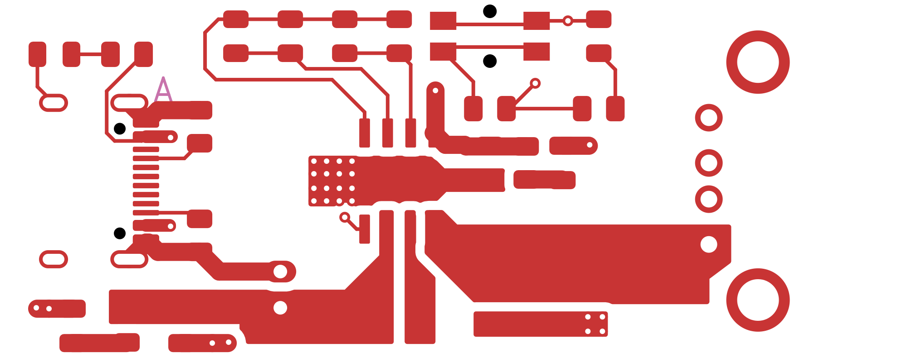
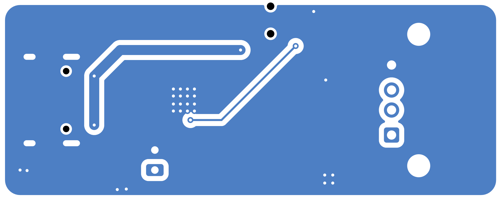
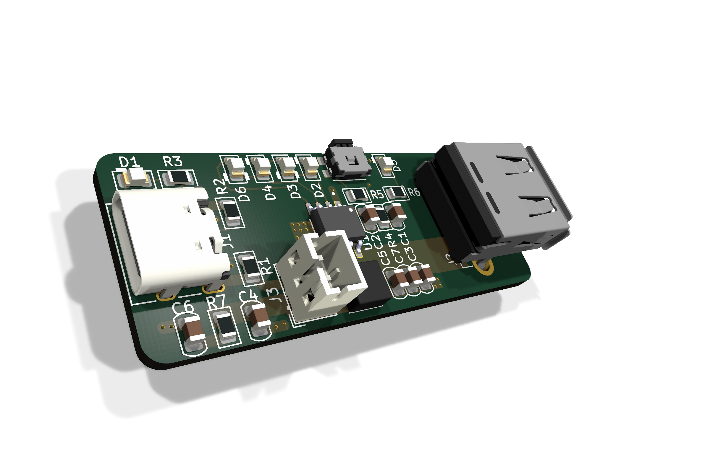

# 2026-09-02: Schematic capture

Started by pulling up the IP5306 datasheet. This little SoC does everything in one chip - it charges the lithium cell, boosts it back up to 5V for output, and even has its own LEDs for capacity and charging state. Most of the work was around it, not in it.

The core parts of the schematic were the IP5306 itself, a USB-C jack for input (charging), a USB-A jack for the 5V output, a JST connector for the battery, two indicator LEDs, and the passives around the power path. I mainly copied the reference circuit from the datasheet, mostly because I trust it more than my own guesses for a power chip like this.

Biggest miss here: I did not connect the USB-C data pins (D+/D-) to anything, just left them floating with the CC pins handled via breakouts. The IP5306 is a dedicated power device, so it does not need data, but leaving them unconnected on the connector is a bit sloppy and I know some host chargers look for something there. For a first version I decided to live with it.

**Total time spent: 3 hours**

# 2026-09-02: Layout and routing

Layout was the part that took most of the session. The board is two layers and I wanted it small, so I ran everything tight. I placed the IP5306 in the middle, USB-C on one edge and USB-A on the other, with the battery connector off to the side.

I put copper pours on both the top and bottom faces to act as a solid ground and to help handle the current on the 5V output path. The boost converter pulls bursts of current, so a thin track would have been a voltage droop problem. I also dropped vias around the pours to stitch the ground planes together across both layers, so there are no dead zones under the IC where return current would have to loop around.

Lesson learned the hard way: I originally routed the battery traces right under the IP5306's inductor. The datasheet explicitly says to keep the switching node and inductor area clean, so I reworked it and moved the battery connector so its tracks bypass that zone. Communicating which nets matter in a power board really changes where things can go.

**Total time spent: 4 hours**

# 2026-09-02: Finishing touches and gerbers

The module is basically done, so today was about closing it out. I went back through and double checked the footprints against the real parts - the USB-C and USB-A connectors, the JST battery header, and the LED packages. Getting a footprint wrong is the exact kind of mistake that only shows up when the board arrives.

I also had to clean up my silkscreen because a bunch of reference designators were sitting on top of copper pours and would have been half-etched away. Moved the critical labels like the battery polarity so nothing confusing is printed over where a pin actually is.

Then I ran the fabrication toolkit and generated the gerbers and the drill files and zipped them up in the project folder. One commit labeled "finish" and it is ready to send off. Still nervous about the USB data pins being left unconnected, but for a bench power bank I think it is fine. Next round I would wire D+ and D- properly.

**Total time spent: 2 hours**
