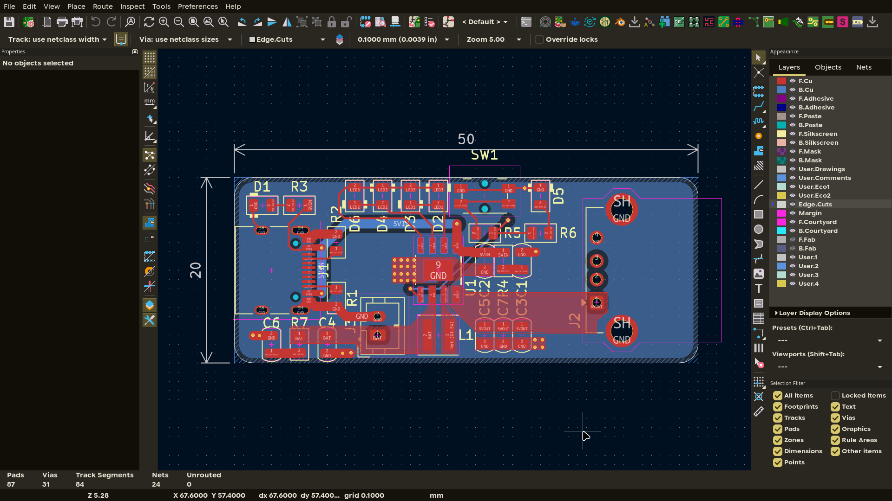
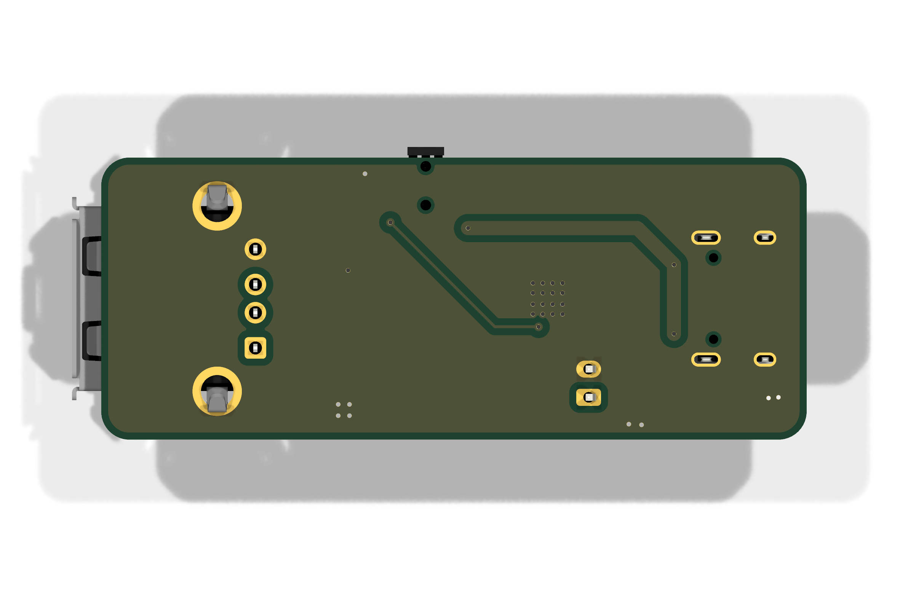

# IP5306 Power-Bank Module

A small USB power bank module that uses a 1S lithium battery and outputs a regulated 5V supply.

This board is a small power bank module built around the Injoinic IP5306 SoC. It takes USB-C input to charge a lithium battery and outputs a regulated 5V rail from a USB-A port in output mode. It is a standalone module with no MCU, only a power button and 4-LED charge/fuel gauge handle all user input. I built it to have a fully integrated power path solution that avoids the complexity of discrete charger and boost circuits.


## Features

- IP5306: fully integrated 2.1A charger and 2.4A discharger with built-in boost converter.
- USB-C input for charging, USB-A output for 5V output.
- 1S Li-ion/LiPo battery connection via JST PH 2-pin header.
- Power button for power on/off and battery gauge.
- 4-LED charge/fuel gauge.
- 1uH shielded inductor for the boost converter.

## How It Works

The IP5306 has the entire power path inside of it. On the input side, 5v from USB-C charges a connected 1S lithium battery through the IP5306's built-in 2.1A charger. On the output side, the chip boosts the battery voltage to a regulated 5V output rail when in power-bank mode. The boost inductor and output capacitors form the boost converter, while the battery, LED, and decoupling capacitors support the charge path, gauge, and IC supply. Pressing the KEY button powers the module on/off and goes through the fuel gauge.

| Block | Part | Role |
|-------|------|------|
| Power | IP5306 | Power Bank SoC with battery charger, boost regulator, 5V rail, charge gauge |
| Input | HRO TYPE-C-31-M-12 | USB-C receptacle for charging input |
| Output | Connfly DS1095 | USB-A receptacle for 5V power-bank output |
| Battery | B2B-PH-K | JST PH 2-pin connector to 1S Li-ion/LiPo battery |
| Inductor | Coilcraft XFL4020-102MEC | 1uH boost converter inductor |
| Capacitors | 10uF x4, 22uF x3  Boost output + IC decoupling |
| Resistors | 5.1k x2, 10k x3, 2 ohm x2 | USB-C CC pulldowns, biasing, LED current limit |
| LEDs | 0805 x6 | Charge and boost status indicators |
| Button | Panasonic EVQPUM | Power on/off + fuel gauge on KEY pin |

### Power Tree

The power path flows from the USB-C input through the IP5306 charger into the battery, and from the battery through the IP5306 boost converter out to the USB-A port. The KEY button and LED gauge hang off the chip's control pins.

| Direction | Path |
|-----------|------|
| Charge | USB-C (5V) -> IP5306 charger -> 1S battery |
| Discharge | 1S battery -> IP5306 boost -> 5V USB-A out |

## Board




*Top layer with the tracks, pads and ground pour.*


*Bottom layer with the stitched ground return path.*




## Usage

1. Connect a 1S Li-ion/LiPo battery to the JST PH connector. 
2. Apply power into the USB-C to charge the battery; the LEDs indicate charge state. 
3. Connect a device to the USB-A port and press the power button to enable the 5V output; short presses cycle the LED fuel gauge and a long press toggles the module on/off.

| Pin | Function |
|-----|----------|
| BAT+ / BAT- | JST PH battery connections (1S Li-ion/LiPo) |
| KEY | Power button input |
| GND | Common ground |

## Repository Structure

```
├── kicad/            # PCB source files
│   └── production/   # Gerbers + drill files
├── cad/              # .step export + native CAD source
├── firmware/         # Firmware source code
├── images/           # Renders, PCB screenshots, build photos
├── BOM.csv           # Bill of materials w/ links + total cost line
└── JOURNAL.md        # Work journal
```

## Cost

| Item | Cost |
|------|------|
| PCB | $3.20 |
| Shipping | $1.50 |
| **PCB subtotal** | **$4.70** |
| Components | $12.99 |
| **Total** | **$17.69** |

See [BOM.csv](BOM.csv) for the full part list with LCSC supplier links.