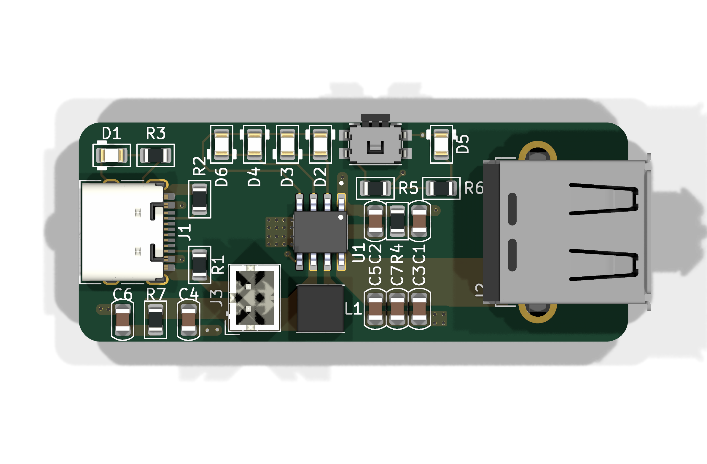

# IP5306 Power-Bank Module

> A standalone USB power-bank module that charges a 1S lithium battery and discharges it as a regulated 5V supply.

This project is a compact power-bank module built around the Injoinic IP5306 power-bank System-on-Chip. It takes USB-C input to charge a lithium battery and outputs a regulated 5V rail from a USB-A port in power-bank mode. It is a standalone, self-contained module with no MCU: a power button and 4-LED charge/fuel gauge handle all user interaction. I built it to explore a fully integrated power path solution that avoids the complexity of discrete charger and boost circuits.



## Features

- IP5306 SoC: fully integrated 2.1A charger and 2.4A discharger with built-in boost converter, eliminating discrete power-path design.
- USB-C input (HRO TYPE-C-31-M-12) for charging, USB-A output (Connfly DS1095) for 5V power-bank mode.
- 1S Li-ion/LiPo battery connection via JST PH 2-pin header (B2B-PH-K vertical).
- Power button (Panasonic EVQPUM) on the KEY pin for power on/off and battery gauge.
- 4-LED charge/fuel gauge driven through 2 ohm series resistors.
- 1uH shielded inductor (Coilcraft XFL4020-102MEC) for the boost converter.

## How It Works

The IP5306 integrates the entire power path. On the input side, USB-C 5V charges a connected 1S lithium battery through the IP5306's built-in 2.1A charger. On the output side, the chip boosts battery voltage to a regulated 5V rail when in power-bank mode. The boost inductor and output capacitors form the switching converter, while the battery, LED, and decoupling capacitors support the charge path, gauge, and IC supply. Pressing the KEY button powers the module on/off and steps through the fuel gauge.

| Block | Part | Role |
|-------|------|------|
| Power | IP5306 | Bank SoC: battery charger, boost regulator, 5V rail, gauge control |
| Input | HRO TYPE-C-31-M-12 | USB-C receptacle for charging input |
| Output | Connfly DS1095 | USB-A receptacle for 5V power-bank output |
| Battery | B2B-PH-K | JST PH 2-pin connector to 1S Li-ion/LiPo battery |
| Inductor | Coilcraft XFL4020-102MEC | 1uH boost converter inductor |
| Capacitors | 10uF x4, 22uF x3 (0805) | Boost output + IC decoupling |
| Resistors | 5.1k x2, 10k x3, 2 ohm x2 | USB-C CC pulldowns, biasing, LED current limit |
| LEDs | 0805 x6 | Charge and boost status indicators |
| Button | Panasonic EVQPUM | Power on/off + fuel gauge on KEY pin |

### Power Tree


## Usage

Connect a 1S Li-ion/LiPo battery to the JST PH connector. Plug a USB-C charger into the input to charge the battery; the LEDs indicate charge state. Connect a device to the USB-A port and press the power button to enable the 5V output in power-bank mode; short presses cycle the LED fuel gauge and a long press powers the module on/off.

| Pin | Function |
|-----|----------|
| BAT+ / BAT- | JST PH battery connections (1S Li-ion/LiPo) |
| KEY | Power button input |
| GND | Common ground |

## Repository Structure

```
├── kicad/            # PCB source files
│   └── production/   # Gerbers + drill files
├── cad/              # .step export + native CAD source
├── firmware/         # Firmware source code
├── images/           # Renders, PCB screenshots, build photos
├── BOM.csv           # Bill of materials w/ links + total cost line
└── JOURNAL.md        # Work journal
```

## Cost

todo

See [BOM.csv](BOM.csv) for full part list with supplier links.

## Known Issues

todo
## Credits & Inspiration

todo
## License

todo
